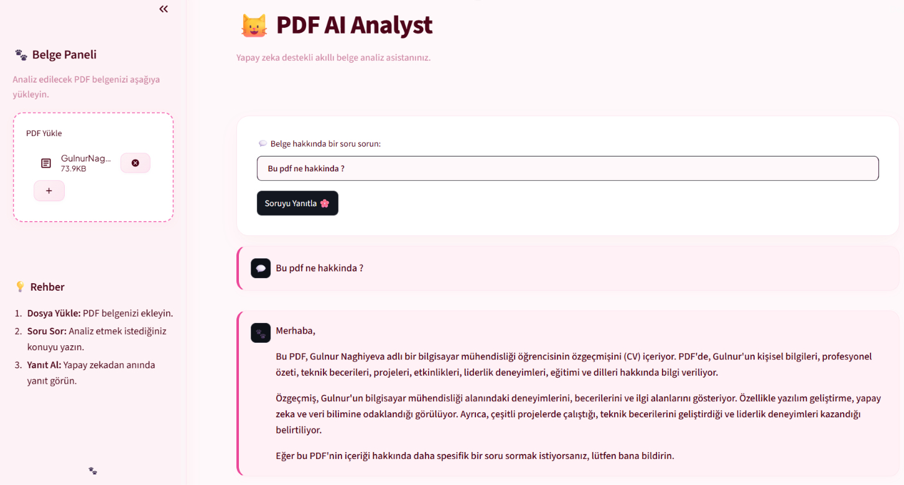

# 📄 PDF AI Analyst - Smart Document QA Assistant

An AI-powered document analysis assistant with a clean, pastel-themed interface. Upload any PDF document and get instant, accurate answers to your questions based on its content.



##  Key Features

- 📑 **PDF Text Extraction:** Seamlessly parses and processes uploaded PDF files.
- 💬 **Context-Aware Q&A:** Delivers accurate answers using Groq API (Llama 3.3 model).
- 🌸 **Custom UI/UX:** Styled with a pastel pink aesthetic and tailored CSS for a smooth visual experience.
- ⚡ **Fast Processing:** Quick response times for analyzing long documents.

##  Tech Stack

- **Framework:** Streamlit
- **LLM Engine:** Groq API (Llama 3.3 70B)
- **PDF Parser:** PyPDF
- **Styling:** Custom CSS

##  Getting Started

1. **Clone the repository:**
   ```bash
   git clone [https://github.com/gulnurnaghiyeva/pdf-ai-analyst.git](https://github.com/gulnurnaghiyeva/pdf-ai-analyst.git)
   cd pdf-ai-analyst